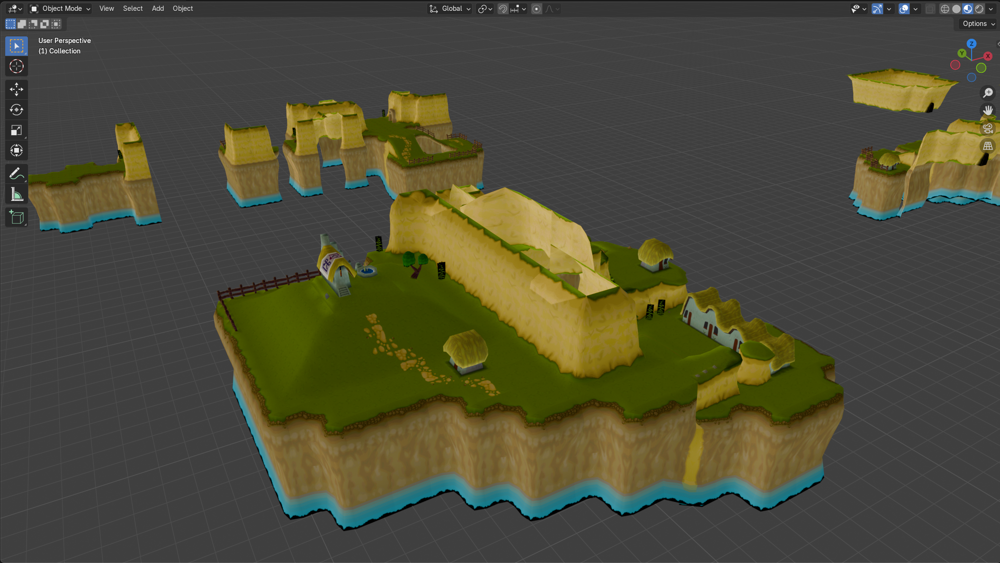
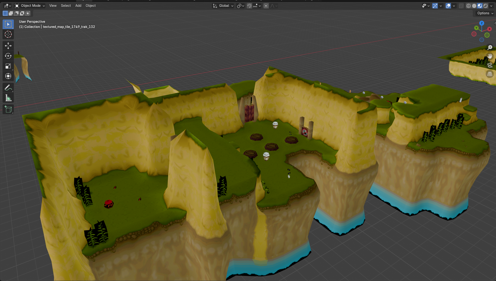
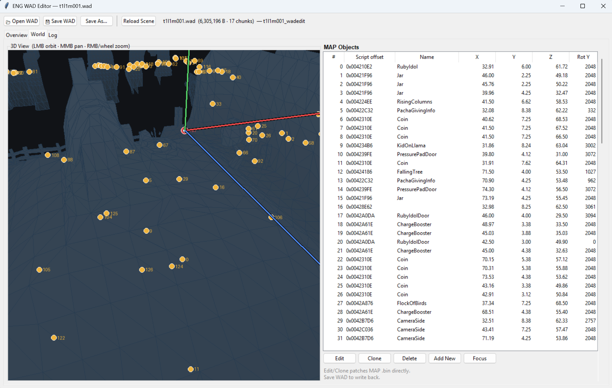
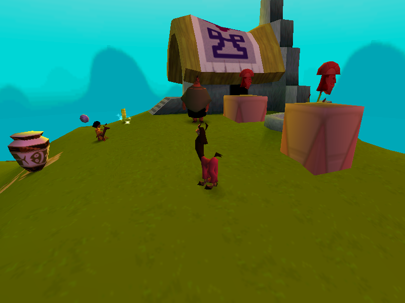

# ENG-Reverse-Engineering
Reverse Engineering of the PC game  "The Emperor's New Groove"






## Layout

| Folder | Contents |
|---|---|
| [`WAD/`](WAD/README.md) | Level `.WAD` extractor, editor and the reverse-engineering notes in [`REVERSE_ENGINEERING_BIBLE.md`](WAD/REVERSE_ENGINEERING_BIBLE.md) |
| [`REVERSED/`](REVERSED/README.md) | Source-level reconstruction of `groove.exe` in C/C++, with an automated byte-comparison harness |
| [`DEM/`](DEM/) | Terrain/heightmap (`.DEM`) unpacker and editor |
| [`COR/`](COR/) | `.COR` image conversion |
| [`DAT/`](DAT/) | `.DAT` movie conversion |

## REVERSED - rebuilding the executable

The executable is a **1.6 MB PE32 built by Visual C++ 6.0** containing 1,214
functions (1,153 real game functions; 59 are incremental-link thunks). `REVERSED/`
reconstructs those functions in C/C++ one at a time and verifies each port by
compiling it and comparing the machine code against the bytes of the original
executable:

```bat
cd REVERSED
build.bat run     :: compile, link the self-test exe, run it
build.bat check   :: compile and byte-compare every ported function
check.bat --list  :: show the remaining work, smallest functions first
```

Current state: 25 functions ported - 3 byte-identical, 9 identical modulo
absolute addresses, 13 structurally equivalent with different code generation.
The harness, the generated work queue (`functions.csv`) and the honest
scope/limits are documented in [`REVERSED/README.md`](REVERSED/README.md).
